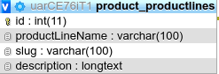
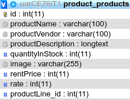
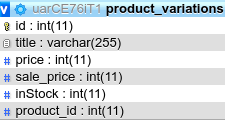
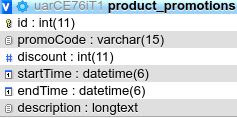
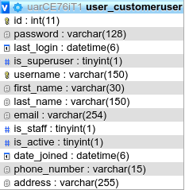
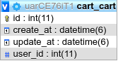
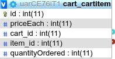
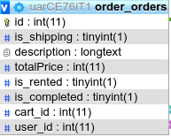
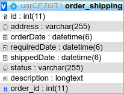
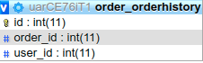

# Rent Express
> BTL CSDL HKII 2019-2020
+ Website cho thuê xe.
+ Ngôn ngữ sử dụng: Python, Django, HTML, CSS, Javascript.

## Chức năng của trang web
+ Trang web quản lý cho thuê xe.
+ Trên trang web có các loại xe: Ô tô, xe máy, xe đạp.
+ Trang web có : Trang chủ, trang thông tin cửa hàng, trang danh sách xe,  trang kết quả search, trang upload thông tin xe, trang blog, trang giỏ hàng.
+ Chức năng search giúp khách hàng tra cứu theo ngày mượn xe, ngày trả xe, địa điểm mượn xe, loại xe,... 
+ Sau khi chọn loại xe, khách hàng có thể đến với giao diện thanh toán, sau đó điền đầy đủ thông tin để tiến hành thanh toán, thông tin của khách hàng sẽ được lưu lại trong cơ sở dữ liệu.
+ Trang Blog sẽ chia sẻ nhưng cẩm nang về thuê xe, khuyến mãi,…
+ Trang About sẽ cung cấp thông tin về cửa hàng, chính sách cho thuê, địa chỉ cho thuê, thời gian tư vấn,...
+ Nhân viên cửa hàng có một giao diện riêng để nhập thông tin loại mới lưu vào cơ sở dữ liệu, từ đó hiển thị trên giao diện những loại xe có số lượng còn lại và sẽ tự động cập nhật khi có khách thuê xe.
+ Khách hàng có thể quản lý thông tin của mình đã cung cấp và lịch sử thuê xe.

## Cơ sở dữ liệu
> Gồm 10 bảng dữ liệu.
### 1. ProductLines

Bảng lưu thông tin chung các loại xe:
- id: Mã loại xe.
- productLineName: Tên loại xe.
- slug: Liên kết.
- description: mô tả chung về loại xe đó.

### 2. Products

Bảng lưu thông tin về từng xe:
- id: mã xe.
- productName: tên xe.
- productVendor: tên hãng sản xuất.
- productDescription: mô tả về xe.
- quantityInStock: số lượng xe còn trong kho.
- image: hình ảnh của xe.
- rentPrice: giá niêm yết cho thuê.
- rate: đánh giá trên 5 sao.
- productLine_id: loại của xe, khóa ngoại tham chiếu đến khóa chính của bảng productlines.

### 3. Variations

Bảng lưu thông tin về mỗi lần thay đổi giá cho thuê:
- id: mã thay đổi.
- title: mô tả thay đổi.
- sale_price: giá sau khi thay đổi.
- inStock: số lượng xe còn lại trong kho.
- product_id:  mã của xe, khóa ngoại tham chiếu đến khóa chính của bảng products.

### 4. Promotions

Bảng lưu thông tin khuyến mãi:
- id: mã thứ tự khuyến mãi.
- promoCode: mã số khuyến mãi.
- discount: phần trăm giảm giá.
- startTime: thời gian bắt đầu.
- endTime: thời gian kết thúc.
- description: mô tả khuyến mãi.

### 5. CustomerUser

Bảng lưu thông tin về khách hàng, kế thừa từ AbstractUser:
- id: mã số của khách hàng trong hệ thống.
- username: tên của khách hàng.
- password: mật khẩu khách hàng.
- first_name: tên đầu.
- last_name: tên cuối.
- email: email của khách hàng.
- phone_number: số điện thoại khách hàng.
- address: địa chỉ khách hàng.

### 6. Cart

Bảng lưu thông tin về khách hàng:
- id: mã của giỏ hàng.
- create_at: thời gian tạo giỏ hàng.
- update_at: thời gian chỉnh sửa giỏ hàng.
- user_id: mã khách hàng. 

### 7. ItemCart

Bảng lưu thông tin về từng xe trong giỏ hàng:
- id: mã item.
- priceEach: Giá từng xe.
- quantityOrdered: Số lượng xe thuê.
- card_id: mã giỏ hàng chứa sản phẩm này. Khóa ngoại đến bảng cart.
- item_id: mã sản phẩm. Khóa ngoại đến bảng variation.

### 8. Orders

Bảng lưu thông tin đặt hàng:
- id: mã số của đơn hàng.
- is_shipping: Có cần ship hay không.
- description: Mô tả đơn hàng.
- totalPrice: Tổng giá tiền đơn hàng.
- is_rented: Đã mượn hay chưa.
- is_completed: Đã trả xe hay chưa.
- cart_id: mã giỏ hàng.
- user_id: mã khách hàng.

### 9. Shipping

Bảng lưu thông tin giao hàng:
- id: mã thứ tự đơn hàng.
- address: địa chỉ giao xe.
- orderDate: ngày đặt xe.
- requiredDate: ngày ước tính khách hàng nhận được xe.
- shippedDate: ngày giao hàng thành công đến tay khách hàng.
- completedDate: ngày khách hàng trả xe.
- status: tình trạng giao hàng.
- description: mô tả thông tin giao hàng. 
- order_id: mã đơn hàng. Khóa ngoại đến bảng orders.

### 10. OrderHistory

Bảng lưu thông tin lịch sử thuê xe:
- id: mã số thứ tự.
- order_id: mã đơn hàng. Khóa ngoại đến bảng orders.
- user_id: mã khách hàng. Khóa ngoại đến bảng CustomerUser.